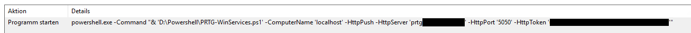
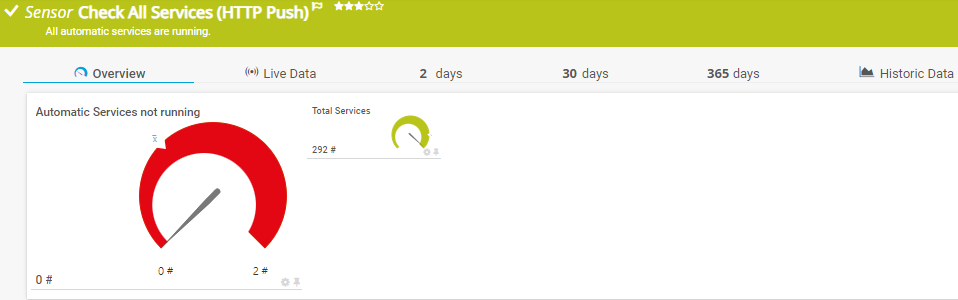
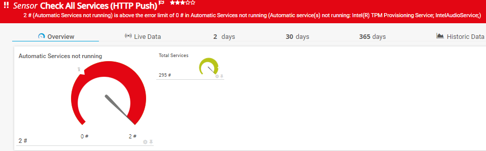
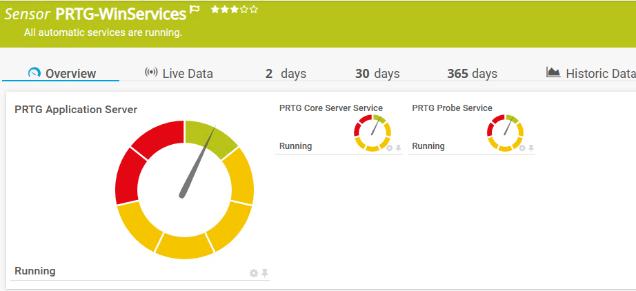

# PRTG-WinServices

## Project Owner:

Jannos-443

## Changelog
### V1.0
- Monitor automatic Windows Services
- Added Ability to use HTTP Push to avoid local Permission on critical Remote Servers (Backup etc.)
### V1.01
- Added Ability to define Critical Services that have to be present
### V1.02
- Added ChannelPerService and HideAutomaticNotRunning parameter

## HOW TO
### Option 1: Execute on Remote Server without PRTG needing local permissions on the Remote Server (HTTP Push Advanced)
1. Place Script on Remote Server (C:\PRTG\PRTG-WinServices.ps1)
2. Create PRTG "HTTP Push Advanced Sensor" and copy the Token (Token is available in the Sensor Settings after creating the Sensor)
   - you should set "no incoming data" to "switch to down status after x minutes"
3. Create Schueduled Task

Example:

`powershell.exe -Command "& 'C:\PRTG\PRTG-WinServices.ps1' -ComputerName 'localhost' -HttpPush -HttpServer 'YourPRTGServer' -HttpPort '5050' -HttpToken 'YourHTTPPushToken'"`




### Option 2: Execute on PRTG Server (EXE Advanced)
1. Place `PRTG-WinService.ps1` under `C:\Program Files (x86)\PRTG Network Monitor\Custom Sensors\EXEXML`

3. Create new Sensor

   | Settings | Value |
   | --- | --- |
   | EXE/Script Advanced | PRTG-WinService.ps1 -ComputerName "%host" |
   | Scanning Interval | 10 min |

## Non Domain or IP

If you connect to **Computers by IP** or to **not Domain Clients** please read [Microsoft Docs](https://docs.microsoft.com/en-us/powershell/module/microsoft.powershell.core/about/about_remote_troubleshooting?view=powershell-7.1#how-to-use-an-ip-address-in-a-remote-command)

you maybe have to add the target to the TrustedHosts on the PRTG Probe and use explicit credentials.

example (replace all currenty entries):

    Set-Item -Path WSMan:\localhost\Client\TrustedHosts -Value "ServerIP1,ServerIP2,ServerHostname1"

example want to and and not replace the list:

    $curValue = (Get-Item wsman:\localhost\Client\TrustedHosts).value
    Set-Item WSMan:\localhost\Client\TrustedHosts -Value "$curValue,NewServer3.test.com"

exmaple PRTG parameter with explicit credentials:

    -ComputerName "%host" -Username "%windowsuser" -Password "%windowspassword"


## Usage
simple check automatic Services of Remote Computer
```powershell
-ComputerName "%host"
```

exclude every service starting with "Intel"
```powershell
-ComputerName "%host" -ExcludePattern '^(Intel.*)$'
```

exclude "Test123" and every service starting with "Intel"
```powershell
-ComputerName "%host" -ExcludePattern '^(Intel.*|Test123)$'
```

only check services starting with "Intel"
```powershell
-ComputerName "%host" -IncludePattern '^(Intel.*)$'
```

filters for "Bitdefender" Services that are preset. CriticalService will be the number of matching services
```powershell
-ComputerName "%host" -CriticalServicePattern '^(Bitdefender)$'
```

filters for "Bitdefender" Services that are preset and running. CriticalService will be the number of matching services
```powershell
-ComputerName "%host" -CriticalServicePattern '^(Bitdefender)$' -CriticalServiceMustRun
```

check automatic Services and require the client to have two matching CriticalServices present and running. Does only work for channel creation.
```powershell
-ComputerName "%host" -CriticalServicePattern '^(Bitdefender|WinDefend)$' -CriticalServiceMustRun -CriticalServiceLimit 2
```

Use explicit credentials ("Windows credentials of parent device" is the better way)
```powershell
-ComputerName "%host" -UserName "YourRemoteComputerUser" -Password "YourRemoteComputerPassword"
```

HTTP Push from Remote Server
```powershell
powershell.exe -Command "& 'C:\PRTG\PRTG-WinServices.ps1' -ComputerName 'localhost' -HttpPush -HttpServer 'YourPRTGServer' -HttpPort '5050' -HttpToken 'YourHTTPPushToken'"
```

HTTP Push from Remote Server and exclude every service starting with "Intel"
```powershell
powershell.exe -Command "& 'C:\PRTG\PRTG-WinServices.ps1' -ComputerName 'localhost' -HttpPush -HttpServer 'YourPRTGServer' -HttpPort '5050' -HttpToken 'YourHTTPPushToken' -ExcludePattern '^(Intel.*)$'"
```

Show channel for each service, use with "IncludePattern"
```powershell
-ComputerName "%host" -IncludePattern '^(prtg.*)$' -HideTotalServiceCount -HideAutomaticNotRunning -ChannelPerService
```

## Examples







## Includes/Excludes

You can use the variables to exclude/include Services
The variables take a regular expression as input to provide maximum flexibility.

For more information about regular expressions in PowerShell, visit [Microsoft Docs](https://docs.microsoft.com/en-us/powershell/module/microsoft.powershell.core/about/about_regular_expressions).

".+" is one or more charakters
".*" is zero or more charakters

## Least Privilege
look into the following links:
 - User has to be in the following groups: Performance Monitor Users and Distributed COM Users
 - Windows Firewall WMI/WinRM
 - Set WMI Permission
  - https://github.com/grbray/PowerShell/blob/main/Windows/Set-WMINameSpaceSecurity.ps1
  - https://knowledgebase.paloaltonetworks.com/KCSArticleDetail?id=kA10g000000ClcsCAC